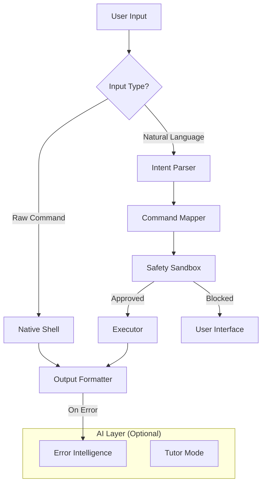

# NL-Terminal v2
### An AI-Augmented Cross-Platform Command Line Interface

---

## 📌 Overview

**NL-Terminal** is an intelligent command-line interface that enhances traditional terminals by allowing users to interact using **natural language**, while still supporting **full raw command execution**.

Instead of replacing the system shell, NL-Terminal operates as a **user-space intelligent layer** on top of the native terminal, preserving correctness, safety, and compatibility while significantly improving usability and learning experience.

The system integrates **offline/local AI**, rule-based command mapping, interactive program passthrough, and user-adaptive modes to create a practical, safe, and extensible terminal environment.

---

## 🎯 New in v2.0

### ✨ Clean & Modern UI
- **Dracula-Themed Interface**: A visually stunning, high-contrast dark theme powered by `rich`.
- **Persistent Session**: No more flickering screens. The history is preserved just like a real terminal.
- **Visual Feedback**: Beautiful panels, spinners for AI thinking, and color-coded status messages (Error, Success, Info).

### 🛡️ Enhanced Stability
- **Crash Protection**: The terminal now features a global error handler that catches unexpected crashes and logs them to `nl_terminal.log` without closing your session.
- **Graceful Failures**: Errors are explained in plain English, keeping you in the flow.

### 🔌 Extensible Plugin System
- **Python Plugins**: Extend the terminal's capabilities by writing simple Python scripts in the `plugins/` directory.
- **Internal Commands**: Plugins can execute system commands or return direct output to the user.
- **Example Plugin**: Includes a `TimePlugin` (try "what time is it?") out of the box.

---

## 🎯 Key Features

### ✅ Natural Language Command Execution
Speak to your terminal in plain English. The system maps your intent to the correct OS-specific command.
- **File Ops:** `create folder demo`, `delete file notes.txt`
- **Navigation:** `go to desktop/projects`, `go back`
- **System:** `check ram`, `kill process chrome`

### ✅ Safety Sandbox & Rollback 🛡️
- **Interactive Safety:** Dangerous commands (delete, kill) require explicit user confirmation.
- **Rollback / Undo:** Accidentally deleted a file? Just type `undo` or `rollback` to restore it immediately from the secure backup.
- **Protected Paths:** Sensitive system directories (like `C:\Windows`) are strictly protected from accidental modification.

### ✅ Full Raw Terminal Support
- Executes real shell commands directly (`dir`, `git status`, `npm start`).
- Supports flags, pipes, redirection, and scripts.
- **Interactive Programs:** Full support for interactive tools like `python`, `vim`, `nano`, `htop`, even on Windows.

### ✅ System Monitoring Utility
Instant access to hardware and network stats without memorizing cryptic flags:
- `check ram` / `check cpu` / `check disk`
- `list processes` / `kill process <name>`
- `check internet` / `my ip`

### ✅ AI-Powered Error Intelligence
When a command fails, the local AI analyzes the error output and:
- Explains what went wrong in simple terms.
- Suggests fixes or alternative commands.
- **Offline Capable:** Works even without an internet connection using local LLMs (Ollama).

### ✅ Adaptive Session Modes
- **Beginner:** Verbose explanations, previews, and guidance.
- **Expert:** Minimal prompts, faster execution.
- **Safe:** Maximum security checks for every action.
*Switch modes anytime:* `mode expert`, `mode beginner`.

### ✅ Explain & Learn
- `explain chmod`: Get a clear explanation of any command.
- `teach me git`: Learn new tools with interactive AI lessons.

---

## 🚀 Getting Started

### Prerequisites
- **Python 3.9+**
- **[Ollama](https://ollama.ai/)** (Optional, for AI features)
  - Recommended model: `ollama run phi`

### ⚡ Quick Start (Windows)
We provide a one-click launcher for Windows users.
1. Download the project.
2. Double-click **`run_terminal.bat`**.
3. It will automatically install dependencies and launch the terminal.

### 🛠️ Manual Installation
If you prefer the command line or are on Linux/macOS:

```bash
# 1. Install dependencies
pip install -r requirements.txt

# 2. Run the terminal
python main.py
```

---

## 🧩 Plugin Development

Want to add your own commands? It's easy!

1. Create a `my_plugin.py` in the `plugins/` folder.
2. Inherit from the `Plugin` class.
3. Define your intents and execution logic.

See `plugins/README.md` and `plugins/time_plugin.py` for examples.

---

## 🏗️ Technical Architecture



- **Core:** `main.py`, `executor.py`
- **Intelligence:** `local_ai.py`, `intent_parser.py`
- **Safety:** `safety.py`, `backup_manager.py`
- **Config:** `config.py`
- **Plugins:** `plugins/`, `plugin_loader.py`

---

## 👤 Author
**Aryan Chaubal**  
Department of Information Technology  
Prof Ram Meghe Institute of Technology & Research, Badnera, Amravati  

---

<p align="center">
  <i>This project is designed for academic evaluation and real-world utility.</i>
</p>
